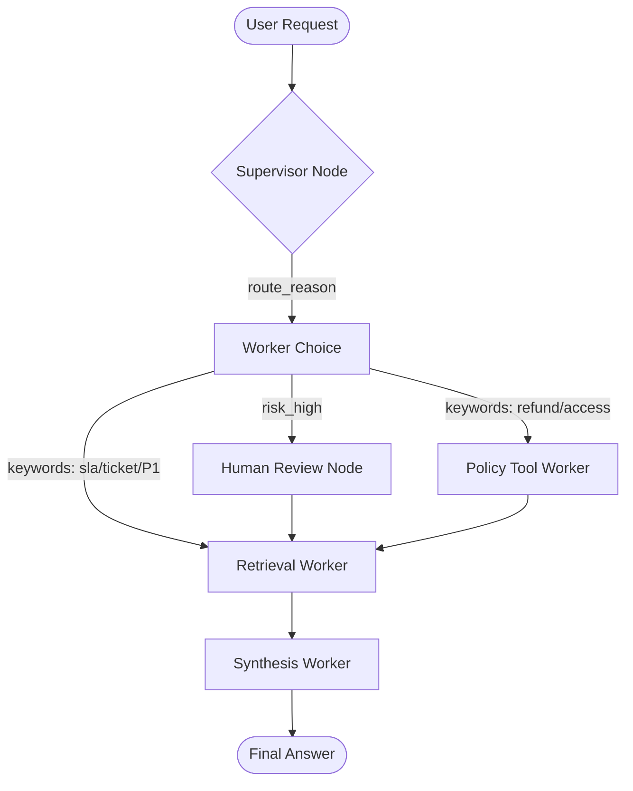

# System Architecture — Lab Day 09

**Nhóm:** Nhóm 10 - Đỗ Hải Nam  
**Ngày:** 2026-04-14  
**Version:** 1.0

---

## 1. Tổng quan kiến trúc

Hệ thống được thiết kế theo mô hình **Multi-Agent Orchestration** sử dụng pattern **Supervisor-Worker**. Thay vì một Agent duy nhất xử lý mọi công đoạn từ tìm kiếm đến trả lời, hệ thống chia nhỏ thành các Worker có chuyên môn riêng biệt, được điều phối bởi một Supervisor trung tâm.

**Pattern đã chọn:** Supervisor-Worker  
**Lý do chọn pattern này (thay vì single agent):**
1. **Tính module hóa:** Có thể thay thế hoặc nâng cấp từng Worker (vd: đổi Embedding model của Retrieval Worker) mà không ảnh hưởng đến Logic của các phần khác.
2. **Khả năng quan sát (Observability):** Từng bước quyết định của Supervisor và output của Worker được ghi lại trong trace giúp dễ dàng debug khi kết quả sai.
3. **Chuyên môn hóa:** Policy Tool Worker có thể tập trung vào logic kiểm tra quy định phức tạp, trong khi Synthesis Worker tập trung vào việc trình bày câu trả lời grounded.

---

## 2. Sơ đồ Pipeline

Hệ thống sử dụng luồng điều phối dựa trên State thực tế:

---

## 3. Vai trò từng thành phần

### Supervisor (`graph.py`)

| Thuộc tính | Mô tả |
|-----------|-------|
| **Nhiệm vụ** | Phân tích câu hỏi đầu vào, phân loại task và điều phối luồng xử lý sang Worker phù hợp. |
| **Input** | `task` (câu hỏi của người dùng) |
| **Output** | `supervisor_route`, `route_reason`, `risk_high`, `needs_tool` |
| **Routing logic** | Sử dụng keyword-based kết hợp logic check risk (emergency keywords). |
| **HITL condition** | Khi xuất hiện mã lỗi không rõ (ERR-) hoặc các từ khóa khẩn cấp cao. |

### Retrieval Worker (`workers/retrieval.py`)

| Thuộc tính | Mô tả |
|-----------|-------|
| **Nhiệm vụ** | Tìm kiếm Hybrid kết hợp ngữ nghĩa và từ khóa từ Knowledge Base (ChromaDB), và thực hiện Reranking cuối cùng. |
| **Data Ingestion** | Semantic Chunking sử dụng **Jina Segmenter API** (mô hình `cl100k_base`). |
| **Embedding model** | Jina API (`jina-embeddings-v5-text-small`) |
| **Hybrid Search** | ChromaDB (Vector Dense) + `rank-bm25` (Sparse Keyword). |
| **Top-k & Rerank** | Tìm top 20 mỗi bộ máy (tổng max 40), sau đó dùng `jina-reranker-v3` lọc top 5. |
| **Stateless?** | Yes |

### Policy Tool Worker (`workers/policy_tool.py`)

| Thuộc tính | Mô tả |
|-----------|-------|
| **Nhiệm vụ** | Phân tích các ngoại lệ chính sách (refund, access) và gọi các MCP tools để tra cứu dữ liệu ngoài. |
| **LLM model** | Groq API (`moonshotai/kimi-k2-instruct`) |
| **MCP tools gọi** | `search_kb`, `get_ticket_info`, `check_access_permission` |
| **Exception cases xử lý** | Flash Sale, Digital products, Activated products, Temporal scoping (v3 vs v4). |

### Synthesis Worker (`workers/synthesis.py`)

| Thuộc tính | Mô tả |
|-----------|-------|
| **LLM model** | Groq API (`moonshotai/kimi-k2-instruct`) |
| **Temperature** | 0.1 (ưu tiên tính chính xác và bám sát context) |
| **Grounding strategy** | Chỉ sử dụng thông tin từ `retrieved_chunks` và `policy_result`, yêu cầu citation [file_name]. |
| **Abstain condition** | Khi `retrieved_chunks` trống hoặc LLM xác định không có thông tin trong tài liệu. |

### MCP Server (`mcp_server.py`)

| Tool | Input | Output |
|------|-------|--------|
| `search_kb` | query, top_k | chunks, sources |
| `get_ticket_info` | ticket_id | ticket status, priority, escalation details |
| `check_access_permission` | access_level, requester_role | can_grant, approvers, emergency_bypass |
| `create_ticket` | priority, title, desc | ticket_id, status |

---

## 4. Shared State Schema

| Field | Type | Mô tả | Ai đọc/ghi |
|-------|------|-------|-----------|
| `task` | str | Câu hỏi đầu vào | Cả hệ thống đọc |
| `supervisor_route` | str | Worker được chọn bởi Supervisor | Supervisor ghi |
| `route_reason` | str | Giải thích tại sao chọn route đó | Supervisor ghi |
| `retrieved_chunks` | list | Chunks văn bản tìm được (đã rerank) | Retrieval ghi, Policy/Synthesis đọc |
| `policy_result` | dict | Kết quả phân tích ngoại lệ | Policy ghi, Synthesis đọc |
| `mcp_tools_used` | list | Lịch sử các tool đã gọi qua MCP | Policy/Retrieval ghi |
| `final_answer` | str | Câu trả lời cuối cùng | Synthesis ghi |
| `confidence` | float | Độ tin cậy của câu trả lời | Synthesis ghi |
| `workers_called` | list | Danh sách các worker đã tham gia | Từng worker ghi |

---

## 5. Lý do chọn Supervisor-Worker so với Single Agent (Day 08)

| Tiêu chí | Single Agent (Day 08) | Supervisor-Worker (Day 09) |
|----------|----------------------|--------------------------|
| Debug khi sai | Khó — phải đọc toàn bộ log prompt dài | Dễ hơn — trace chỉ rõ worker nào trả ra data lỗi |
| Thêm capability mới | Phải sửa toàn prompt hệ thống | Thêm worker hoặc MCP tool mới linh hoạt |
| Routing visibility | Không có | Rõ ràng qua `route_reason` và `supervisor_route` |
| Hiệu năng | Nhanh nhưng dễ hallucinate policy | Chậm hơn một chút (nhiều bước) nhưng cực kỳ grounded |

---

## 6. Giới hạn và điểm cần cải tiến

1. **Độ trễ (Latency):** Việc gọi nhiều API (Jina Embedding, Jina Rerank, Groq LLM) qua internet tốn nhiều thời gian hơn so với local model.
2. **Routing:** Hiện tại Supervisor dựa trên keyword đơn giản, có thể cải tiến bằng một LLM Router siêu nhẹ để phân loại chính xác hơn các câu hỏi phức tạp.
3. **Reranking Cost:** Việc rerank mọi query tốn thêm chi phí API call, cần cơ chế cache kết quả rerank cho các câu hỏi tương tự.

